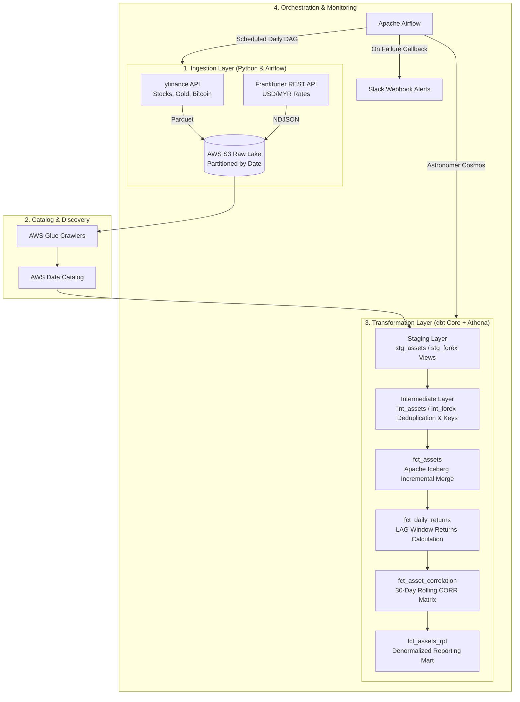

# Multi-Asset Correlation & Diversification Risk Pipeline

Automated batch data pipeline that ingests daily market prices across Malaysian equities, US equities, crypto, and gold, converts cross-border valuations into MYR, and computes 30-day rolling correlation matrices to detect when "diversified" portfolios move in lockstep.


---

## Table of Contents
- [Problem Statement](#problem-statement)
- [Architecture](#architecture)
- [Tech Stack](#tech-stack)
- [Data Sources](#data-sources)
- [Pipeline Design](#pipeline-design)
  - [Ingestion Layer](#ingestion-layer)
  - [Transformation Layer (dbt Core)](#transformation-layer-dbt-core)
  - [Orchestration (Airflow & Astronomer Cosmos)](#orchestration-airflow--astronomer-cosmos)
- [Data Quality & Testing](#data-quality--testing)
- [Results & Key Insights](#results--key-insights)
- [Challenges & Design Decisions](#challenges--design-decisions)
- [Limitations & Future Work](#limitations--future-work)
- [How to Run](#how-to-run)

---

## Problem Statement

Retail and institutional investors often split holdings across geographically distinct asset classes (e.g., local equities, foreign indices, precious metals, and digital assets) assuming this protects against market downside. However, during periods of macro stress or liquidity crunches, historically uncorrelated assets frequently spike in correlation, invalidating diversification exactly when risk mitigation matters most.

This pipeline automates daily price tracking for:
* **Malaysian Equities:** FTSE Bursa Malaysia KLCI (`^KLSE`)
* **US Equities:** S&P 500 (`^GSPC`)
* **Digital Assets:** Bitcoin USD (`BTC-USD`)
* **Precious Metals:** SPDR Gold Shares (`GLD`)
* **Forex Conversion:** USD/MYR exchange rate via Frankfurter API

**Business Value:** Serves as an automated early-warning signal for portfolio managers to monitor cross-asset correlation shifts, dynamically measure currency-adjusted risk in local currency (MYR), and identify systemic market co-movements without manual data collection.

---

## Architecture



---

## Tech Stack

| Layer | Tool / Tech | Why It Was Chosen |
| :--- | :--- | :--- |
| **Ingestion** | Python (`yfinance`, `requests`, `awswrangler`) | Lightweight, handles market closure gaps gracefully, writes partitioned Parquet/NDJSON directly to S3. |
| **Storage & Lakehouse** | AWS S3 & Apache Iceberg | Hive-partitioned raw storage (`year/month/day`) combined with Apache Iceberg for ACID transactions and efficient upserts. |
| **Catalog & Query Engine** | AWS Glue & AWS Athena | Fully serverless pay-per-query model; eliminates idle database cluster costs for daily batch runs. |
| **Transformation** | dbt Core (`dbt-athena-community`) | Modular Medallion architecture, automated lineage parsing, and version-controlled SQL transformations. |
| **Orchestration** | Apache Airflow (Astronomer Cosmos) | Industry-standard DAG scheduling with Cosmos rendering dbt models directly into native Airflow tasks. |
| **Monitoring & Alerting** | Slack API Webhooks | Sends real-time Slack notifications with direct Airflow log links whenever a task fails. |

---

## Data Sources

| Source | Target Asset / Exchange | Frequency | Method | Storage Format |
| :--- | :--- | :--- | :--- | :--- |
| **Yahoo Finance** | S&P 500 (`^GSPC`), KLCI (`^KLSE`) | Daily (Trading days) | Python API Wrapper (`yfinance`) | Parquet (`snappy`) |
| **Yahoo Finance** | Bitcoin USD (`BTC-USD`) | Daily (24/7) | Python API Wrapper (`yfinance`) | Parquet (`snappy`) |
| **Yahoo Finance** | SPDR Gold Shares (`GLD`) | Daily (Trading days) | Python API Wrapper (`yfinance`) | Parquet (`snappy`) |
| **Frankfurter API** | USD/MYR Foreign Exchange Rate | Daily (Business days) | REST API Endpoint (`/v2/rates`) | NDJSON |

---

## Pipeline Design

### Ingestion Layer
* **Daily Ingestion Tasks:** Airflow tasks (`daily_forex`, `daily_stocks`, `daily_bitcoin`, `daily_gold`) run daily post-market close.
* **Partitioned S3 Storage:** Raw data lands in S3 bucket prefixes organized by date: `raw/<asset_class>/year=YYYY/month=MM/day=DD/`.
* **Market Closure Safeguard:** Ingestion functions evaluate `if df.empty:` (e.g., weekends or exchange holidays) and log a skip action rather than crashing or uploading corrupt empty files.

### Transformation Layer (dbt Core)
Following a 3-tier Medallion Architecture:

```
Raw S3 Catalog ──► Staging (Views) ──► Intermediate (Deduplication) ──► Marts (Iceberg Facts & Views)
```

1. **Staging (`stg_assets`, `stg_forex`):** Casts data types, standardizes currency names, unpivots wide stock tables into long format, and injects staging audit metadata.
2. **Intermediate (`int_assets`, `int_forex`):** Generates surrogate keys using `dbt_utils.generate_surrogate_key` and applies windowed deduplication (`ROW_NUMBER() OVER (PARTITION BY ... ORDER BY _staged_at DESC)`) keeping only the latest batch.
3. **Marts (`fct_assets`, `fct_daily_returns`, `fct_asset_correlation`, `fct_assets_rpt`):**
   * `fct_assets`: Incremental **Apache Iceberg** fact table combining price histories, joining exchange rates, and calculating converted close prices in MYR (`close_price_myr`).
   * `fct_daily_returns`: Calculates daily percentage returns per asset using SQL `LAG()` window functions.
   * `fct_asset_correlation`: Calculates 30-day rolling correlation across 6 asset pairs (`S&P 500`, `KLCI`, `BTC`, `Gold`) using Athena windowed correlation functions (`CORR() OVER (...)`).
   * `fct_assets_rpt`: Denormalized reporting mart joining date dimensions (`dim_dates`), prices, returns, and rolling correlations into a single queryable reporting structure.

### Orchestration (Airflow & Astronomer Cosmos)
* **DAG Scheduling:** Scheduled daily (`@daily`) with `catchup=False` and `max_active_runs=1` to preserve execution sequence.
* **Crawler Integration:** `GlueCrawlerRunOperator` triggers schema discovery immediately after ingestion tasks complete, keeping Athena table definitions up to date.
* **Cosmos Execution:** `DbtTaskGroup` automatically compiles dbt models into an Airflow task graph, enabling granular task retries and step-by-step UI tracking.
* **Slack Failure Alerts:** Integrated `on_failure_callback` sends error alerts containing task details and direct Airflow log URLs to Slack.

---

## Data Quality & Testing

Data quality guardrails are enforced at every pipeline boundary:

### 1. Automated dbt Tests (32 Configured Assertion Tests)
* **Source Level (`_sources.yml`):** `not_null` tests on raw ingestion dates across all 4 source tables.
* **Staging Level (`_stg_schema.yml`):** `not_null` assertions on rates and prices; `accepted_values` tests enforcing USD, MYR, and expected ticker symbols (`^GSPC`, `^KLSE`, `BTC_USD`, `GLD`).
* **Intermediate Level (`_int_schema.yml`):** `unique` and `not_null` constraints on generated surrogate keys (`asset_key`, `forex_key`).
* **Marts Level (`_mrt_schema.yml`):** `not_null` assertions across calculated correlation matrices; `relationships` foreign key validation linking fact records to `dim_dates` and `dim_assets`.
* **Seed Level (`_seed_schema.yml`):** `unique` and `not_null` assertions on primary key `ticker` in asset dimension table.

### 2. Lineage Audit & Macro Injections
All transformation models call a custom Jinja macro (`audit_columns`) that stamps execution metadata (`_staged_at`, `_processed_at`, `_refined_at`) along with the dbt `invocation_id` batch key to maintain full auditability.

---

## Results & Key Insights

Based on multi-asset daily return calculations:

* **Equities Realized Diversification:** The 30-day rolling correlation between Malaysian equities (KLCI) and US equities (S&P 500) averages **~0.25 to 0.35**, confirming that geographic equity diversification remains effective under normal market conditions.
* **Crypto vs Traditional Safe Havens:** Bitcoin (`BTC_USD`) exhibits volatile rolling correlation shifts relative to Gold (`GLD`) and the S&P 500, ranging from negative decorrelation during consolidation phases to positive spikes during broader market rallies.
* **Warm-up Sample Filtering:** Correlation estimates during the initial 30 days of dataset initiation are filtered out (`WHERE day_number >= 30`) to eliminate extreme statistical noise caused by insufficient sample sizes.

---

## Challenges & Design Decisions

### 1. Why AWS Athena over Amazon Redshift?
**Decision:** Selected AWS Athena serverless query engine over a provisioned Redshift cluster.  
**Reasoning:** Since this is a low-frequency daily batch pipeline with lightweight data volumes, a provisioned cluster would sit idle 95%+ of the day while incurring continuous costs. Athena's pay-per-query model keeps operating costs near zero while providing ANSI SQL capability.

### 2. Handling Non-Trading Day Gaps
**Decision:** Rather than forward-filling missing prices on market holidays (which artificially dampens return volatility and distorts correlation), data ingestion skips non-trading dates. SQL calculations use windowed `LAG()` logic on active trading days to measure returns accurately without introducing zero-return artifacts.

### 3. Late-Arriving Data with Incremental Merges
**Decision:** Implemented an Apache Iceberg table format for `fct_assets` using an incremental `merge` strategy with a 3-day lookback window (`price_date >= max(price_date) - interval '3' day`).  
**Reasoning:** Financial data providers occasionally issue retroactively revised settlement figures or delayed forex quotes. The 3-day lookback window captures upstream updates during incremental runs without requiring costly full table rebuilds.

### 4. Idempotent Deduplication Strategy
**Decision:** Chose a `ROW_NUMBER() OVER (PARTITION BY natural_keys ORDER BY _staged_at DESC)` strategy in intermediate models to retain the most recently staged record.  
**Reasoning:** Guarantees that re-running DAGs or backfilling historical dates overwrites stale data with the latest execution payload rather than producing duplicate rows.

---

## Limitations & Future Work

* **Dashboard Integration:** Queries are verified via AWS Athena and dbt documentation; connecting a light BI layer (e.g., Apache Superset or AWS QuickSight) is planned for direct correlation matrix visualization.
* **CI Warehouse Integration:** GitHub Actions currently lints Python code and validates DAG/dbt compilation; running live dbt build integration tests against an isolated staging schema in AWS Athena is planned for future iterations.
* **Asset Class Expansion:** The current pipeline covers 4 core assets across equities, crypto, and gold; the staging schema design allows adding new tickers by appending ingestion scripts and seed entries without refactoring core SQL models.

---

## How to Run

### Prerequisites
* AWS account configured with S3, Glue, and Athena permissions
* Docker Desktop & Astro CLI installed
* Python 3.10+

### 1. Clone Repository & Configure Environment
```bash
git clone https://github.com/hannanrazalli/assets-correlation-pipeline.git
cd assets-correlation-pipeline
cp .env.example .env
```
*(Ensure `.env` contains your `BUCKET_NAME', `DBT_TARGET_SCHEMA`, 'S3_ATHENA_STAGING_DIR', 'S3_ATHENA_DATA_DIR' and 'FOREX_URL=https://api.frankfurter.dev/v2/rates')*

### 2. Start Airflow Environment
```bash
astro dev start
```
Access the Airflow UI at `http://localhost:8080` to trigger `00_Daily_Asset_Pipeline`.

### 3. Run dbt Transformations & Quality Tests Manually
```bash
cd include/dbt/asset_correlation
dbt deps
dbt run --profiles-dir .
dbt test --profiles-dir .
```
