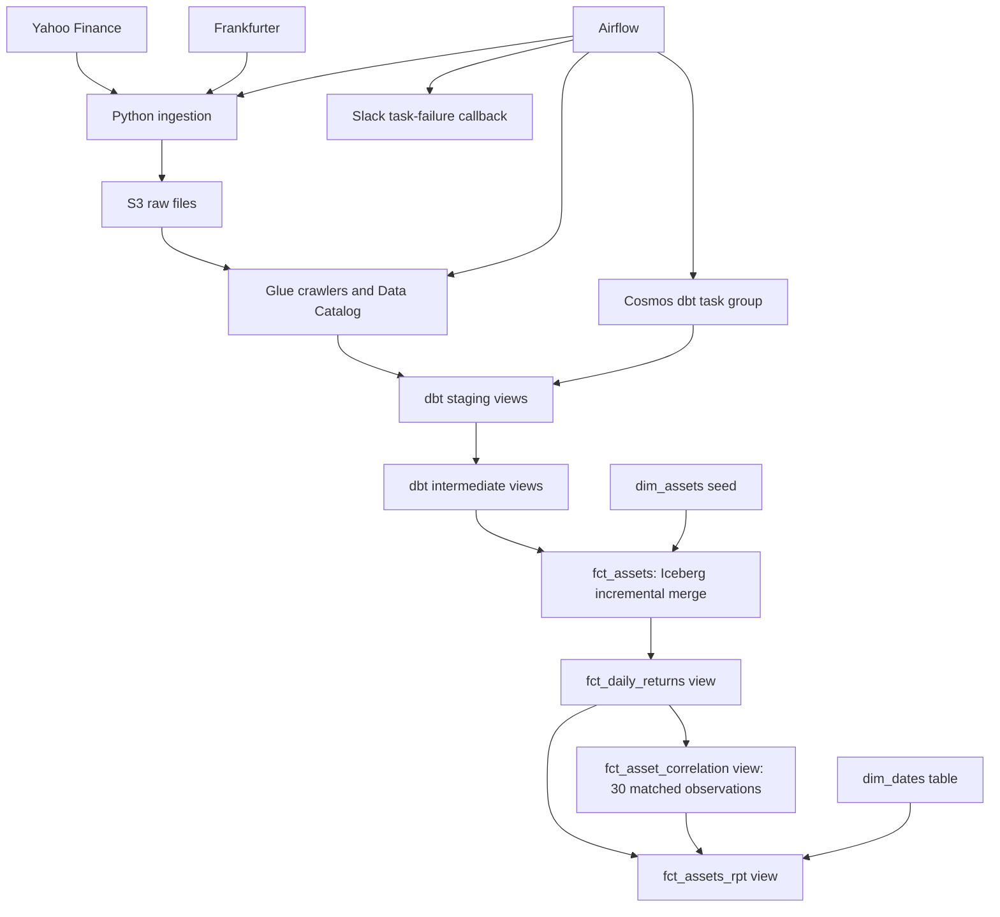

# Multi-Asset Correlation Pipeline

This project loads daily data for the S&P 500, KLCI, Bitcoin and GLD into S3. Airflow runs ingestion and Glue crawlers, while dbt transforms the data in Athena to calculate returns from MYR-denominated price series and rolling correlations over 30 matched observations.

The output is a reporting dataset for exploring cross-asset movement. It does not calculate portfolio risk or issue correlation-threshold alerts. Missing exchange rates currently fall back to `1.0`; affected USD values are therefore not valid MYR conversions. See [limitations](#limitations) before interpreting the results.


## Data sources

| Series | Source | Role | Raw format |
| --- | --- | --- | --- |
| S&P 500 (`^GSPC`) | Yahoo Finance through `yfinance` | US equity index proxy | Parquet |
| KLCI (`^KLSE`) | Yahoo Finance through `yfinance` | Malaysian equity index proxy | Parquet |
| Bitcoin (`BTC-USD`) | Yahoo Finance through `yfinance` | Crypto price series | Parquet |
| SPDR Gold Shares (`GLD`) | Yahoo Finance through `yfinance` | Gold ETF proxy | Parquet |
| USD/MYR | Frankfurter `/v2/rates` | Currency conversion | NDJSON |

The indices are not portfolio holdings, and GLD is an ETF rather than a spot-gold series. Equity and ETF observations depend on trading calendars; Bitcoin trades throughout the week.

## Architecture



Python handles API requests and S3 writes. Glue catalogs the raw files. Athena executes dbt SQL; only `fct_assets` is an incremental Iceberg table. Airflow and its supporting services run separately from the serverless query/storage services.

## Repository layout

```text
dags/daily_dag.py                    Daily ingestion, crawlers and dbt task group
include/ingestions/api/              Stocks, Bitcoin, gold and forex loaders
include/utilities/                   Cosmos configuration and Slack callback
include/dbt/asset_correlation/
  models/staging/                   Source casts and asset-series union
  models/intermediate/              Natural-key deduplication and surrogate keys
  models/marts/                     Prices, returns, correlations and reporting
  macros/audit_columns.sql          dbt execution metadata
  seeds/dim_assets.csv              Asset lookup
.github/workflows/                  CI checks and EC2 deployment workflow
docs/subagent-reference.md           Agent selection guide by component and stack
```

## Pipeline behaviour

The DAG `00_Daily_Asset_Pipeline` uses `@daily`, `catchup=False` and `max_active_runs=1`. Each ingestion task receives Airflow's `ds` date. The Yahoo loaders request that day's interval and return without writing if the result is empty. Empty data is treated as a skip; the code does not distinguish a market closure from a provider problem. The forex loader checks HTTP status but has no equivalent empty-result safeguard.

Files use date-specific paths under `raw/<asset_class>/year=YYYY/month=MM/day=DD/`. Each ingestion task has a corresponding Glue crawler. The Cosmos task group starts after all four crawlers finish. Scheduling is daily rather than explicitly tied to each exchange's market-close time.

| dbt object | Materialization | Behaviour |
| --- | --- | --- |
| `stg_assets`, `stg_forex` | Views | Cast raw fields; combine four asset series into long format |
| `int_assets`, `int_forex` | Views | Generate surrogate keys and select one row per natural key |
| `dim_assets` | Seed | Ticker, asset name, asset class and base currency |
| `dim_dates` | Table | Calendar dates from 2020 through 2030 |
| `fct_assets` | Incremental Iceberg table | Join prices, FX and asset metadata; merge by `asset_key` |
| `fct_daily_returns` | View | Percentage change from each asset's previous available observation |
| `fct_asset_correlation` | View | Six pair correlations over 30 complete-case observations |
| `fct_assets_rpt` | View | Calendar, price, return and correlation columns |

The correlation model first keeps dates where all four returns are non-null. It then uses `ROWS BETWEEN 29 PRECEDING AND CURRENT ROW` and retains rows with `day_number >= 30`. The first output therefore needs 30 matched return observations, which can span more than 30 calendar days. Existing `_30d` column names are retained for compatibility.

### Reprocessing and execution metadata

The incremental fact reads raw observations dated within three calendar days of the maximum date already in the fact. This can merge revised raw values inside that window, but ingestion does not automatically refetch previous days. Provider revisions must first be re-ingested. Older backfills require a separate rebuild or loading procedure; replaying ingestion alone does not bypass the fact's date filter.

Intermediate models order duplicates by `_staged_at`. Because staging is a view and that field uses `current_timestamp`, it is not a persisted source-arrival timestamp and cannot establish which conflicting duplicate was ingested last.

The audit macro is used in staging, intermediate and `fct_assets` models. View timestamps are evaluated at query time; invocation IDs identify the dbt execution that rendered the SQL. These fields provide execution context, not a complete ingestion or revision history.

## Validation and deployment

There are 32 configured generic dbt tests:

| Layer | Count | Checks |
| --- | --- | --- |
| Sources | 4 | Non-null source dates |
| Staging | 9 | Required fields and expected currencies/tickers |
| Intermediate | 4 | Unique, non-null surrogate keys |
| Marts | 13 | Fact keys, relationships, converted prices and correlation outputs |
| Seed | 2 | Unique, non-null ticker |

Configured tests are not a passing test-run record. They also do not establish freshness, dataset completeness, FX correctness or statistical validity. An empty correlation view can pass column-level non-null tests because there are no failing rows.

GitHub Actions runs Ruff, checks DAG import errors with `DagBag`, and runs `dbt deps` plus `dbt parse` using a dummy Athena profile. It does not execute transformations or tests against Athena, and parsing is not warehouse SQL validation.

The CD workflow runs on pushes to `main` or manual dispatch. It temporarily permits the runner IP on EC2 SSH, syncs the remote checkout to `origin/main`, conditionally restarts Astro when image inputs change, checks Airflow health, and attempts ingress cleanup. This workflow requires GitHub secrets and an existing EC2 setup. Its presence does not prove a deployment succeeded, and it is not explicitly gated on completion of the CI workflow.

Required GitHub secrets are `AWS_ACCESS_KEY_ID`, `AWS_SECRET_ACCESS_KEY`, `AWS_REGION`, `AWS_SG_ID`, `EC2_HOST`, `EC2_USER` and `EC2_SSH_KEY`. The remote checkout is reset to `origin/main`, so deployment is intended for a dedicated checkout without local edits.

Slack notifications use the `slack_alert_conn` connection and contain task details and an Airflow log URL. Delivery is best effort: the callback currently has no request timeout or HTTP-response validation.

## How to run

### Prerequisites and AWS resources

You need Docker Desktop, Astro CLI, AWS access and existing resources in `ap-southeast-1`. The Dockerfile selects Astro Runtime `3.3-8`; Python dependency files use version ranges rather than a fully locked environment. For manual dbt execution, install the project's dependencies in a compatible Python environment. CI currently requests Python 3.10.

Create the S3 bucket/prefixes, Glue database, Athena workgroup/results location and these Glue crawlers before triggering the DAG:

| Crawler name | S3 prefix | Expected Glue table |
| --- | --- | --- |
| `forex_crawler_asset_correlation` | `raw/forex/` | `raw_forex` |
| `stocks_crawler_asset_correlation` | `raw/stocks/` | `raw_stocks` |
| `bitcoin_crawler_asset_correlation` | `raw/bitcoin/` | `raw_bitcoin` |
| `gold_crawler_asset_correlation` | `raw/gold/` | `raw_gold` |

The dbt source declarations currently use the Glue schema `asset_correlation`. Keep that raw database name unless you also update `_sources.yml`. `DBT_TARGET_SCHEMA` controls model output placement, not the source database. Verify crawler table names and columns against the staging SQL; the repository does not provision AWS resources or configure crawler naming rules. Manual dbt uses Athena workgroup `primary`.

AWS permissions must cover the configured S3 paths, Glue catalog/crawler operations and Athena queries, with Lake Formation or KMS access where your environment requires it.

### Configure and start Airflow

```bash
git clone https://github.com/hannanrazalli/assets-correlation-pipeline.git
cd assets-correlation-pipeline
cp .env.example .env
```

On PowerShell, use `Copy-Item .env.example .env` for the last step. Replace the example values with your bucket, schema and Athena paths. Keep credentials out of tracked files.

```bash
astro dev start
```

Open `http://localhost:8080` and configure:

- `aws_default`: an Amazon Web Services connection with access to your resources. Ingestion and Cosmos use this connection. Ensure credentials are available inside the Airflow runtime, not only on the host.
- `slack_alert_conn`: the callback concatenates the connection's host and password to form the webhook URL. Put the URL prefix in host and the secret suffix in password; do not commit the webhook.

`airflow_settings.yaml` is a starter template, not a working connection setup. Confirm DAG import and connection configuration before triggering `00_Daily_Asset_Pipeline`.

The DAG does not automatically load historical data because catchup is disabled. A fresh daily setup will not immediately produce a correlation result. Establish sufficient raw history and populate `dim_assets` before expecting the reporting models to contain correlations.

### Run dbt manually

Manual dbt uses `profiles.yml` and the AWS `default` profile, separately from Airflow's `aws_default` connection. Set the following environment variables in the shell that runs dbt. dbt does not automatically load the root `.env` file.

```powershell
$env:DBT_TARGET_SCHEMA = "asset_correlation"
$env:S3_ATHENA_STAGING_DIR = "s3://your-bucket/athena-results/"
$env:S3_ATHENA_DATA_DIR = "s3://your-bucket/dbt-data/"
```

With raw Glue tables and AWS credentials available:

```bash
cd include/dbt/asset_correlation
dbt deps --profiles-dir .
dbt seed --profiles-dir .
dbt run --profiles-dir .
dbt test --profiles-dir .
```

These commands write to the configured AWS target. For an isolated validation, use a separate target schema and data prefix. A full refresh can rebuild the fact from raw history, but should be planned against downstream consumers rather than used as a routine retry.

## Inspecting results

After a successful warehouse run, inspect `fct_assets_rpt` for prices, returns and the six correlation columns. This repository does not include a reproducible results snapshot that supports a particular average correlation or diversification outcome.

When publishing results, include the query, observation date range, matched sample count, missing-data treatment and run evidence. Correlation alone does not establish portfolio protection or causality.

## Limitations

- **Missing FX:** USD-denominated series use `1.0` when the date has no FX match. The existing non-null price test cannot detect this incorrect conversion. A consistent missing-FX policy and treatment of affected historical rows are still needed.
- **Return alignment:** `LAG()` uses each asset's previous available price. A Monday equity return can cover Friday to Monday while Bitcoin covers Sunday to Monday. Matching date labels does not align those intervals or exchange closing times.
- **Complete-case selection:** All six correlations use dates where all four returns exist. Missing one series removes that date even for pairs that do not include it.
- **Precision and sample size:** Returns and correlations are rounded to two decimals. Thirty observations and warm-up filtering do not guarantee a stable estimate; constant returns can also produce null correlations.
- **Revisions and audit ordering:** The merge window needs updated raw data; view timestamps do not identify the latest source revision. Historical replay and conflicting-duplicate handling need explicit procedures.
- **Expansion:** New tickers require updates to ingestion, seeds, staging unions, tests, return pivots, correlation expressions and reporting columns.
- **Operations:** Live warehouse integration tests, FX-quality checks, a BI dashboard and threshold-based correlation alerts are not implemented. AWS cost has not been measured here; Athena, Glue, S3 and EC2 each contribute to total cost.

Athena fits this batch workflow without a dedicated warehouse cluster, but cost and performance should be assessed from actual queries and infrastructure usage.