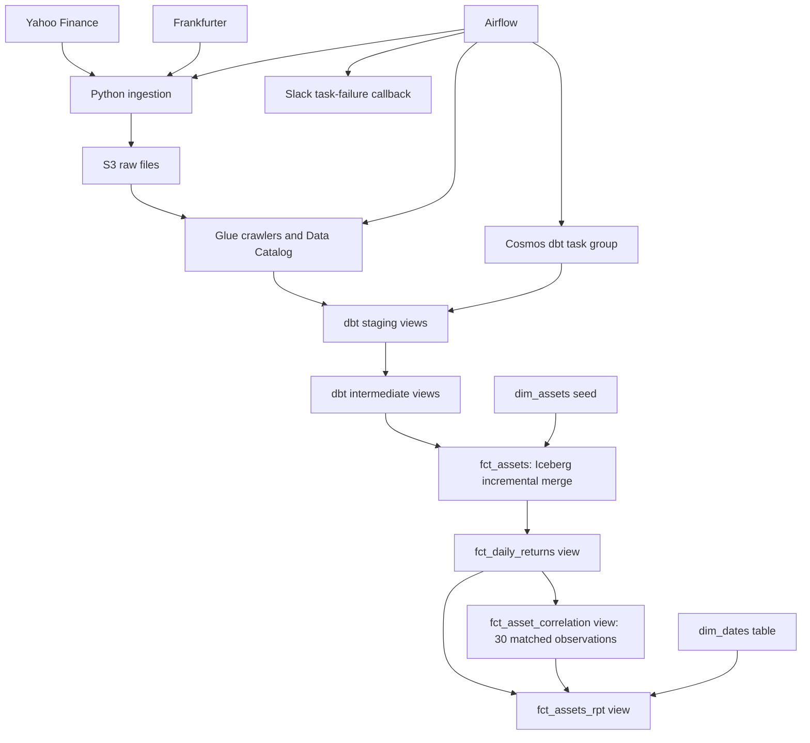

# Multi-Asset Correlation Pipeline

This project collects daily prices for the S&P 500, KLCI, Bitcoin and GLD, then stores them in S3. Airflow runs the data loaders and Glue crawlers. dbt transforms the data in Athena. It converts prices to MYR, calculates daily returns and compares each pair of assets using rolling correlations over 30 shared observations.

The output helps you explore how these assets move in relation to each other. It does not measure portfolio risk or send alerts when correlations cross a threshold. If an exchange rate is missing, the pipeline uses `1.0`. The affected USD prices are then not valid MYR conversions. Read [Limitations](#limitations) before using the results.


## Data sources

| Series | Source | Role | Raw format |
| --- | --- | --- | --- |
| S&P 500 (`^GSPC`) | Yahoo Finance through `yfinance` | US equity index proxy | Parquet |
| KLCI (`^KLSE`) | Yahoo Finance through `yfinance` | Malaysian equity index proxy | Parquet |
| Bitcoin (`BTC-USD`) | Yahoo Finance through `yfinance` | Crypto price series | Parquet |
| SPDR Gold Shares (`GLD`) | Yahoo Finance through `yfinance` | Gold ETF proxy | Parquet |
| USD/MYR | Frankfurter `/v2/rates` | Currency conversion | NDJSON |

The indices are market proxies, not portfolio holdings. GLD is a gold ETF, not a spot-gold price. Stock and ETF data follow market trading days. Bitcoin trades every day.

## Architecture



Python requests data from the APIs and writes it to S3. Glue records the raw files in the data catalog. Athena runs the dbt SQL. Of the dbt models, only `fct_assets` is an incremental Iceberg table. Airflow runs separately from these AWS query and storage services.

## Repository layout

```text
dags/daily_dag.py                    Daily ingestion, crawlers and dbt task group
include/ingestions/api/              Stocks, Bitcoin, gold and forex loaders
include/utilities/                   Cosmos configuration and Slack callback
include/dbt/asset_correlation/
  models/staging/                   Source casts and asset-series union
  models/intermediate/              Natural-key deduplication and surrogate keys
  models/marts/                     Prices, returns, correlations and reporting
  macros/audit_columns.sql          dbt execution metadata
  seeds/dim_assets.csv              Asset lookup
.github/workflows/                  CI checks and EC2 deployment workflow
```

## Pipeline behaviour

The `00_Daily_Asset_Pipeline` DAG runs once a day. It does not catch up on missed runs, and it allows only one active run at a time. Airflow passes the run date (`ds`) to each loader. The Yahoo Finance loaders request data for that date and skip the write if no data is returned. The pipeline does not tell whether an empty result means a market closure or a provider issue. The forex loader checks the HTTP response, but does not have the same check for an empty result.

Files use date-based paths such as `raw/stocks/year=2026/month=10/day=10/`. Each loader has a Glue crawler. The Cosmos task group starts after all four crawlers finish. The DAG runs daily. It is not scheduled around each exchange's market close.

| dbt object | Materialization | Behaviour |
| --- | --- | --- |
| `stg_assets`, `stg_forex` | Views | Cast raw fields and combine the four asset series into one table |
| `int_assets`, `int_forex` | Views | Generate surrogate keys and select one row per natural key |
| `dim_assets` | Seed | Ticker, asset name, asset class and base currency |
| `dim_dates` | Table | Calendar dates from 2020 through 2030 |
| `fct_assets` | Incremental Iceberg table | Join prices, FX and asset metadata. Merge rows by `asset_key` |
| `fct_daily_returns` | View | Percentage change from each asset's previous available observation |
| `fct_asset_correlation` | View | Six pair correlations over 30 complete-case observations |
| `fct_assets_rpt` | View | Calendar, price, return and correlation columns |

The correlation model uses only dates that have returns for all four assets. For each result, it looks at the current row and the previous 29 matching rows. It produces a result after 30 shared observations. Those observations can cover more than 30 calendar days. The model keeps the existing `_30d` column names for compatibility.

### Reprocessing and execution metadata

The incremental fact model reads raw observations from the three calendar days ending at its latest date. This lets it merge updated values in that window. However, the loaders do not automatically fetch previous days again. Re-ingest data before expecting the model to pick up provider revisions. Older backfills need a separate rebuild or loading procedure. Re-running the loader alone does not bypass the fact model's date filter.

Intermediate models sort duplicate rows by `_staged_at`. Staging is a view, and `_staged_at` uses `current_timestamp`. It is calculated when the view runs, so it does not record when data arrived. It cannot reliably identify the newest copy of a conflicting row.

The audit macro adds metadata to staging, intermediate and `fct_assets` models. A view's timestamp is calculated when queried. Invocation IDs show which dbt run produced the SQL. This metadata describes dbt execution. It is not a full history of data loads or revisions.

## Validation and deployment

There are 32 configured generic dbt tests:

| Layer | Count | Checks |
| --- | --- | --- |
| Sources | 4 | Non-null source dates |
| Staging | 9 | Required fields and expected currencies/tickers |
| Intermediate | 4 | Unique, non-null surrogate keys |
| Marts | 13 | Fact keys, relationships, converted prices and correlation outputs |
| Seed | 2 | Unique, non-null ticker |

This table lists configured tests. It does not show that the tests have passed. The tests also do not confirm that data is current or complete, that currency conversion is correct, or that results are statistically valid. An empty correlation view can pass non-null checks because it has no rows to fail them.

GitHub Actions runs Ruff, checks DAG imports with Airflow's `DagBag`, and runs `dbt deps` and `dbt parse` with a dummy Athena profile. CI does not run transformations or tests in Athena. A successful parse does not confirm that the SQL works in the warehouse.

The CD workflow runs when code is pushed to `main` or when started manually. It temporarily allows the GitHub runner to connect to EC2 over SSH. It updates the remote checkout to `origin/main`, restarts Astro when image inputs change, checks Airflow health and then tries to remove the temporary network rule. It requires GitHub secrets and an existing EC2 setup. The workflow file alone does not confirm that a deployment succeeded. CD is not explicitly set to wait for CI to finish.

Required GitHub secrets are `AWS_ACCESS_KEY_ID`, `AWS_SECRET_ACCESS_KEY`, `AWS_REGION`, `AWS_SG_ID`, `EC2_HOST`, `EC2_USER` and `EC2_SSH_KEY`. The remote checkout is reset to `origin/main`, so deployment is intended for a dedicated checkout without local edits.

Slack notifications use the `slack_alert_conn` connection. They include task details and an Airflow log link. Delivery is best effort. The callback does not set a request timeout or check the HTTP response.

## How to run

### Prerequisites and AWS resources

You need Docker Desktop, Astro CLI and AWS access. The AWS resources must already exist in `ap-southeast-1`. The Dockerfile uses Astro Runtime `3.3-8`. Python dependencies use version ranges, so installs may not use the exact same package versions each time. To run dbt manually, install the project dependencies in a compatible Python environment. CI uses Python 3.10.

Create the S3 bucket/prefixes, Glue database, Athena workgroup/results location and these Glue crawlers before triggering the DAG:

| Crawler name | S3 prefix | Expected Glue table |
| --- | --- | --- |
| `forex_crawler_asset_correlation` | `raw/forex/` | `raw_forex` |
| `stocks_crawler_asset_correlation` | `raw/stocks/` | `raw_stocks` |
| `bitcoin_crawler_asset_correlation` | `raw/bitcoin/` | `raw_bitcoin` |
| `gold_crawler_asset_correlation` | `raw/gold/` | `raw_gold` |

dbt expects the raw Glue database to be named `asset_correlation`. If you use another name, update `_sources.yml` too. `DBT_TARGET_SCHEMA` sets where dbt writes its models. It does not change the raw database name. Check that crawler table names and columns match the staging SQL. This repository does not create AWS resources or set crawler naming rules. Manual dbt runs use the Athena workgroup `primary`.

The AWS user or role needs access to the configured S3 paths, Glue catalog and crawlers, and Athena queries. Your account may also require Lake Formation or KMS permissions.

### Configure and start Airflow

```bash
git clone https://github.com/hannanrazalli/assets-correlation-pipeline.git
cd assets-correlation-pipeline
cp .env.example .env
```

On PowerShell, run `Copy-Item .env.example .env` instead of the last command. Replace the example values with your bucket, schema and Athena paths. Do not put credentials in files tracked by Git.

```bash
astro dev start
```

Open `http://localhost:8080` and configure:

- `aws_default`: an AWS connection with access to your resources. The ingestion tasks and Cosmos use it. Make sure Airflow can access the credentials from inside its runtime.
- `slack_alert_conn`: the callback joins the connection's host and password to build the webhook URL. Put the URL prefix in `host` and the secret suffix in `password`. Do not commit the webhook URL.

`airflow_settings.yaml` is a template. It does not configure working connections by itself. Check that the DAG imports and the connections work before you trigger `00_Daily_Asset_Pipeline`.

The DAG does not load historical data automatically. A new setup will not produce correlations right away. Load enough historical data and populate `dim_assets` first.

### Run dbt manually

Manual dbt uses `profiles.yml` and the AWS `default` profile. This is separate from Airflow's `aws_default` connection. Set these environment variables in the shell where you run dbt. dbt does not load the root `.env` file automatically.

```powershell
$env:DBT_TARGET_SCHEMA = "asset_correlation"
$env:S3_ATHENA_STAGING_DIR = "s3://your-bucket/athena-results/"
$env:S3_ATHENA_DATA_DIR = "s3://your-bucket/dbt-data/"
```

With raw Glue tables and AWS credentials available:

```bash
cd include/dbt/asset_correlation
dbt deps --profiles-dir .
dbt seed --profiles-dir .
dbt run --profiles-dir .
dbt test --profiles-dir .
```

These commands write to AWS. To validate without affecting your normal data, use a separate target schema and data prefix. A full refresh rebuilds the fact table from raw history. Plan one before running it because other users or models may depend on that table.

## Inspecting results

After a successful warehouse run, check `fct_assets_rpt` for prices, returns and the six correlation columns. This repository does not include a results snapshot to support claims about average correlation or diversification.

When you share results, include the query, date range, number of matched observations, how missing data was handled and evidence of the run. Correlation alone does not prove that a portfolio is protected or that one asset causes another to move.

## Limitations

- **Missing FX:** USD-denominated series use `1.0` when the date has no FX match. The existing non-null price test cannot detect this incorrect conversion. A consistent missing-FX policy and treatment of affected historical rows are still needed.
- **Return alignment:** `LAG()` uses each asset's previous available price. A Monday equity return can cover Friday to Monday while Bitcoin covers Sunday to Monday. Matching date labels does not align those intervals or exchange closing times.
- **Complete-case selection:** All six correlations use dates where all four returns exist. Missing one series removes that date even for pairs that do not include it.
- **Precision and sample size:** Returns and correlations are rounded to two decimal places. Thirty observations do not guarantee a stable estimate. Constant returns can produce a null correlation.
- **Revisions and audit ordering:** The merge window can only use updated raw data that has been loaded. View timestamps do not show which source revision is newest. Historical reloads and duplicate conflicts need a separate process.
- **Expansion:** New tickers require updates to ingestion, seeds, staging unions, tests, return pivots, correlation expressions and reporting columns.
- **Operations:** The project does not include live warehouse integration tests, FX quality checks, a BI dashboard or correlation alerts. AWS cost has not been measured. Athena, Glue, S3 and EC2 all contribute to it.

Athena runs this batch workflow without a dedicated warehouse cluster. Measure cost and performance using real queries and infrastructure usage.
